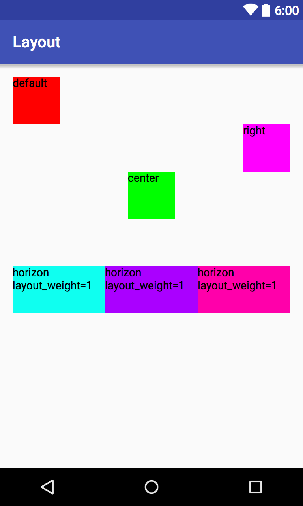

# Android Layout Example

## LinearLayout
> is a view group that aligns all children in a single,
> vertical or horizontally

* LayoutParams
  * layout_gravity
  * layout_weight

---

### RelativeLayout
> is a view group that display child views in relative positions either to
> the sibling elements or to the parent

### RelativeLayout : mode `align to parent`

* LayoutParams
  * layout_alignParentRight
  * layout_alignParentBottom
  * layout_alignParentTop
  * layout_centerHorizontal
  * layout_centerVertical
  * layout_centerInParent

  

### RelativeLayout : mode `slign to sibling view ability`

* LayoutParams
  * Neighborhood
    * layout_below
    * layout_above
    * layout_toRightOf
    * layout_toLeftOf
  * Edge align
    * layout_alignTop
    * layout_alignBottom
    * layout_alignLeft
    * layout_alignRight

---

### FrameLayout
> is designed to block out an area on the screen to display
> a single item

(like RelativeLayout but reduce some feature)

* LayoutParams
  * layout_gravity
  

